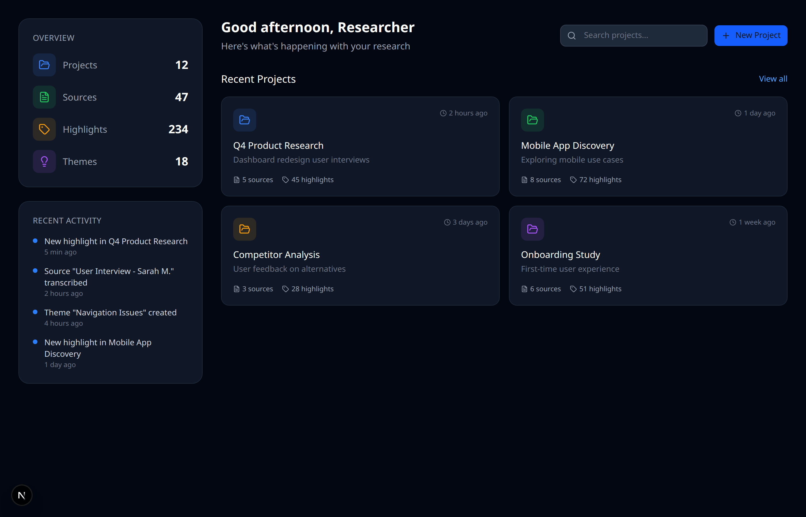
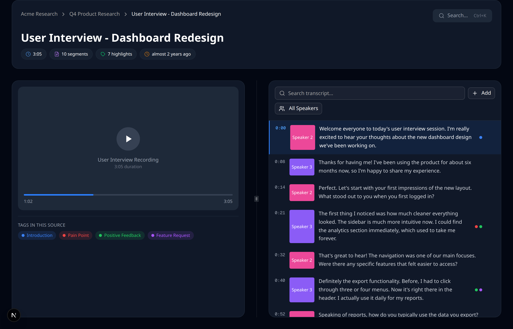
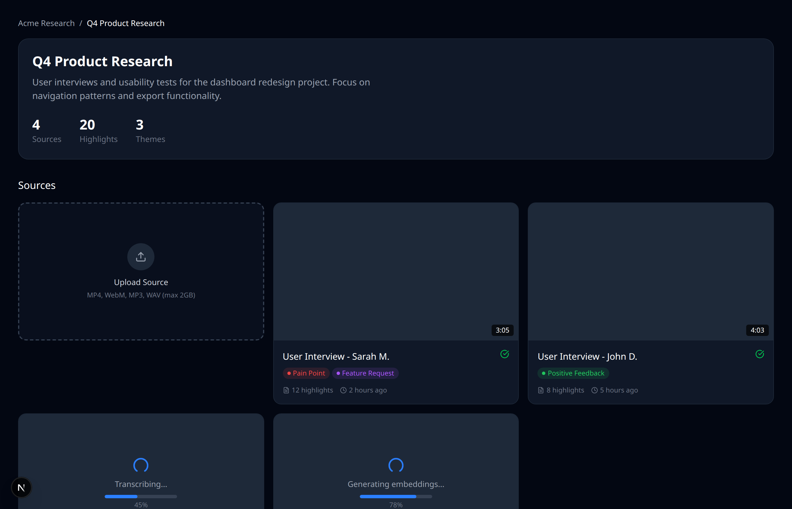
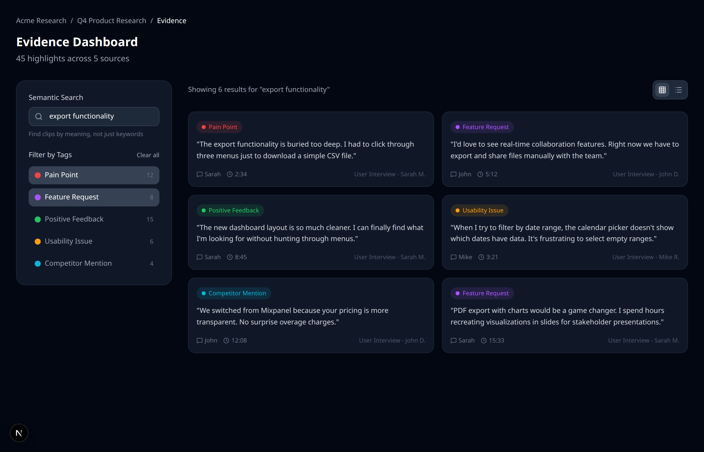
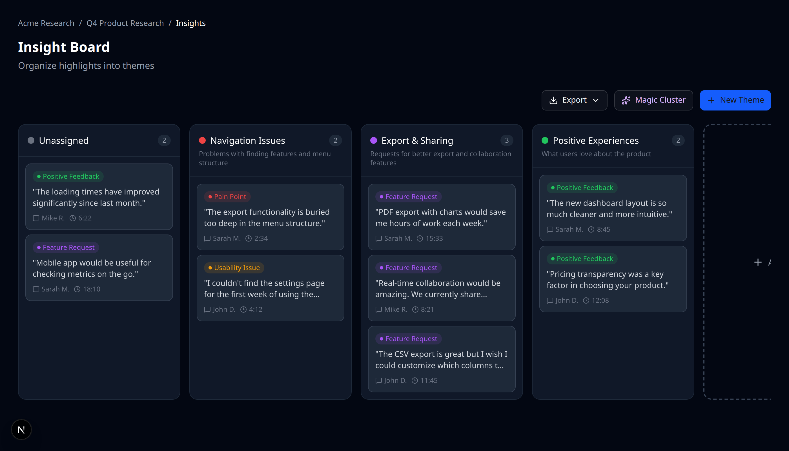

<p align="center">
  
</p>

<h1 align="center">OpenInsights</h1>

<p align="center">
  <strong>Self-hosted, AI-powered research intelligence platform.</strong><br>
  Transcribe interviews. Find patterns. Own your data.
</p>

<p align="center">
  <a href="#quick-start">Quick Start</a> &bull;
  <a href="#features">Features</a> &bull;
  <a href="#why-openinsights">Why OpenInsights</a> &bull;
  <a href="#architecture">Architecture</a> &bull;
  <a href="CONTRIBUTING.md">Contributing</a>
</p>

<p align="center">
  
  
  
  
  
</p>

<p align="center">
  
</p>

---

## Why OpenInsights?

Most UX research tools force a choice: **convenience or privacy**. We built something better.

| Problem                                                 | OpenInsights Solution                                         |
| ------------------------------------------------------- | ------------------------------------------------------------- |
| :lock: Sensitive interviews on someone else's servers   | Run 100% locally with Ollama — data never leaves your machine |
| :money_with_wings: Per-seat pricing kills team adoption | Free forever, self-host without limits                        |
| :electric_plug: Vendor lock-in with proprietary formats | Open source, standard PostgreSQL, export everything           |
| :snail: Manual transcription takes hours                | AI transcribes and suggests highlights in minutes             |
| :mag: Search only finds exact keywords                  | Semantic search finds meaning, not just words                 |

### How We Compare

| Feature             |    OpenInsights    | Dovetail | Condens |  Grain  |
| ------------------- | :----------------: | :------: | :-----: | :-----: |
| Self-hosted         |      **Yes**       |    No    |   No    |   No    |
| Open source         |      **MIT**       |    No    |   No    |   No    |
| Local AI (Ollama)   |      **Yes**       |    No    |   No    |   No    |
| Free tier           |   **Unlimited**    | Limited  | Limited | Limited |
| Semantic search     |      **Yes**       |   Yes    |   Yes   |   No    |
| Video analysis      |      **Yes**       |   Yes    |   Yes   |   Yes   |
| Speaker diarization | **Yes** (Deepgram) |   Yes    |   Yes   |   Yes   |
| Self-hosted STT     | **Yes** (WhisperX) |    No    |   No    |   No    |

---

## Features

<table>
<tr>
<td width="50%">

### :clapper: Analysis Canvas

Synchronized video playback with interactive transcript. Click any word to jump to that moment with **±100ms accuracy**. Keyboard shortcuts for power users.

</td>
<td width="50%">



</td>
</tr>
<tr>
<td width="50%">

### :sparkles: AI-Powered Transcription

Upload video or audio files up to **2GB**. Get accurate transcripts with speaker detection in minutes.

**Supported providers:**

- **Deepgram** (recommended) — Native diarization, excellent accuracy
- **AssemblyAI** — High-accuracy speaker diarization
- **OpenAI Whisper** — Industry-standard transcription
- **WhisperX** (self-hosted) — Fully local, GPU required

</td>
<td width="50%">



</td>
</tr>
<tr>
<td width="50%">

### :dart: Evidence Dashboard

Semantic search across all your projects. Find that quote you vaguely remember in seconds.

**Embedding providers:**

- **OpenAI** (cloud, 1536 dimensions) — Best quality
- **Gemini** (cloud, 768 dimensions)
- **Ollama** (local, 768 dimensions) — Fully offline

</td>
<td width="50%">



</td>
</tr>
<tr>
<td width="50%">

### :jigsaw: Insight Board

Kanban-style drag-and-drop organization. **Magic Cluster** uses AI to automatically suggest theme groupings from your highlights.

</td>
<td width="50%">



</td>
</tr>
</table>

### More Features

| Feature                                 | Description                                                               |
| --------------------------------------- | ------------------------------------------------------------------------- |
| :label: **Tagging System**              | Create tags inline while highlighting. Custom colors, instant UI updates. |
| :outbox_tray: **Export**                | Generate Markdown or PDF reports. Preserves timestamps and themes.        |
| :busts_in_silhouette: **Multi-tenancy** | Workspace-based data isolation for teams.                                 |

### Privacy Options

| Setup               | Transcription          | Embeddings     | Data Location       |
| ------------------- | ---------------------- | -------------- | ------------------- |
| :cloud: **Cloud**   | Deepgram / AssemblyAI  | OpenAI         | Your infrastructure |
| :repeat: **Hybrid** | Deepgram / OpenAI      | Ollama (local) | Your infrastructure |
| :house: **Local**   | WhisperX (self-hosted) | Ollama         | Fully on-premise    |

---

## Quick Start

### Prerequisites

- Node.js 20+
- pnpm 10+
- Docker and Docker Compose

### Setup

```bash
# Clone the repository
git clone https://github.com/ertad-family/openinsights.git
cd openinsights

# Install dependencies
pnpm install

# Run the self-hosted setup script
./scripts/setup-self-hosted.sh

# Build and start production server
pnpm build
pnpm start
```

In a separate terminal, start the background worker:

```bash
pnpm worker
```

Open [http://localhost:3000](http://localhost:3000) and create your account.

**The first user to register becomes the organization owner.**

After logging in, go to **Settings > AI Settings** to configure your AI providers. No API keys in `.env` required — everything is configured via the UI.

> **See [docs/self-hosting.md](docs/self-hosting.md) for full deployment guide including Docker production setup and customization options.**

Workers handle:

- Audio extraction (FFmpeg)
- Transcription (Deepgram/AssemblyAI/OpenAI/WhisperX)
- Vectorization (OpenAI/Gemini/Ollama)
- Summaries & Clustering (Gemini/OpenAI)

<details>
<summary><strong>:gear: Configure AI Providers</strong></summary>

After logging in, go to **Settings > AI Settings** to configure:

| Section           | Options                                | Description                             |
| ----------------- | -------------------------------------- | --------------------------------------- |
| **Transcription** | Deepgram, AssemblyAI, OpenAI, WhisperX | Speech-to-text with speaker diarization |
| **Embeddings**    | OpenAI, Gemini, Ollama                 | Semantic search vectors                 |
| **General AI**    | Gemini, OpenAI                         | Summaries, clustering, theme naming     |

All API keys are encrypted and stored securely in the database.

</details>

<details>
<summary><strong>:whale: Docker Production Deployment</strong></summary>

```bash
# Start all services (web app + worker + infrastructure)
docker compose --profile production up -d

# Or just infrastructure for local development
docker compose up -d

# Optional: Self-hosted AI services
docker compose --profile whisperx up -d   # WhisperX (GPU required)
docker compose --profile ollama up -d     # Ollama (local embeddings)
```

AI configuration is done via the Settings page after deployment. Required environment variables:

```bash
# Required for security
ENCRYPTION_KEY=""    # openssl rand -hex 32
AUTH_SECRET=""       # openssl rand -base64 32
```

See [docs/self-hosting.md](docs/self-hosting.md) for complete production deployment guide.

</details>

<details>
<summary><strong>:llama: Local with Ollama (fully offline embeddings)</strong></summary>

```bash
# 1. Start Ollama via Docker Compose
docker compose --profile ollama up -d

# Or install Ollama manually
curl -fsSL https://ollama.com/install.sh | sh
ollama pull nomic-embed-text

# 2. Run OpenInsights
docker compose up -d
pnpm dev

# 3. In Settings > AI Settings, select:
#    - Embeddings: Ollama
#    - Ollama URL: http://localhost:11434
```

</details>

---

## Architecture

```
                          Next.js 15 Frontend
    +-----------+    +-----------+    +-----------+    +---------------+
    |  Projects |    |   Canvas  |    |  Evidence |    | Insight Board |
    +-----------+    +-----------+    +-----------+    +---------------+
                              |
                    Next.js API Routes (22 endpoints)
                              |
          +-------------------+-------------------+
          |                   |                   |
          v                   v                   v
  +---------------+   +---------------+   +---------------+
  |  PostgreSQL   |   |     Redis     |   |     MinIO     |
  |  + pgvector   |   |   (BullMQ)    |   |   (Storage)   |
  +---------------+   +---------------+   +---------------+
                              |
                              v
                        BullMQ Workers
    +---------------+  +---------------+  +--------------------+
    |    Audio      |  | Transcription |  |   Vectorization    |
    |  Extraction   |  |   (Deepgram/  |  |    (OpenAI/        |
    |   (FFmpeg)    |  |   AssemblyAI) |  | Gemini/Ollama)     |
    +---------------+  +---------------+  +--------------------+
```

### Processing Pipeline

```
Upload → S3/MinIO → Audio Extraction → Transcription → Vectorization → Ready
             ↓           (FFmpeg)       (Deepgram/      (OpenAI/
        Presigned URL                  AssemblyAI/      Gemini/Ollama)
        (resumable)                    OpenAI/WhisperX)       ↓
                                            ↓          Embeddings stored
                                    Speaker diarization   in pgvector
```

### Tech Stack

| Layer          | Technology                                   |
| -------------- | -------------------------------------------- |
| **Framework**  | Next.js 15 (App Router), React 19            |
| **Styling**    | Tailwind CSS v4, Shadcn/UI, Radix UI         |
| **State**      | Zustand                                      |
| **Database**   | PostgreSQL 16 + pgvector                     |
| **ORM**        | Prisma 7                                     |
| **Queue**      | BullMQ + Redis                               |
| **Storage**    | MinIO (local) / AWS S3 (production)          |
| **AI**         | Deepgram, AssemblyAI, OpenAI, Gemini, Ollama |
| **Validation** | Zod                                          |
| **Logging**    | Pino                                         |
| **Testing**    | Vitest + React Testing Library               |

### Data Model

```
Workspace (multi-tenant container)
  └── Project (research study)
       ├── Source (video/audio file)
       │    └── TranscriptSegment (timestamped text + embedding)
       │         └── Highlight (tagged selection)
       ├── Tag (taxonomy with colors)
       │    └── Highlight
       └── Theme (insight grouping)
            └── HighlightTheme (many-to-many)
```

---

## Development

```bash
# Run tests (uses real database, no mocking)
pnpm test

# Watch mode
pnpm test:watch

# Code quality
pnpm lint          # ESLint
pnpm format        # Prettier
pnpm typecheck     # TypeScript
pnpm spellcheck    # CSpell

# Database
pnpm exec prisma migrate dev    # Run migrations
pnpm exec prisma studio         # Visual database browser
```

### Git Workflow

We use GitFlow with conventional commits:

- `main` — Production releases
- `develop` — Active development
- `feature/*` — New features
- `fix/*` — Bug fixes

Commit format: `type(scope): message`

---

## Roadmap

- [x] Analysis Canvas with synced transcript
- [x] Multi-provider AI transcription (Deepgram, AssemblyAI, OpenAI, WhisperX)
- [x] Semantic search with pgvector
- [x] Evidence Dashboard with filtering
- [x] Insight Board with Magic Cluster
- [x] Organization-level AI configuration via Settings UI
- [x] Export to Markdown and PDF
- [x] Self-hosted transcription (WhisperX with speaker diarization)
- [ ] Collaborative workspaces with team sharing
- [ ] Interview guide templates
- [ ] Plugin system for custom integrations

---

## Contributing

We welcome contributions! OpenInsights is built by researchers, for researchers.

**Quick links:**

- :bug: [Report a bug](https://github.com/ertad-family/openinsights/issues/new?labels=bug)
- :bulb: [Request a feature](https://github.com/ertad-family/openinsights/issues/new?labels=enhancement)
- :dart: [Good first issues](https://github.com/ertad-family/openinsights/labels/good%20first%20issue)
- :book: [Contributing guide](CONTRIBUTING.md)

### Development Setup

```bash
git clone https://github.com/ertad-family/openinsights.git
cd openinsights
pnpm install
./scripts/setup-self-hosted.sh
pnpm dev
# Configure AI providers via Settings > AI Settings after logging in
```

---

## License

[MIT](LICENSE) — use it however you want.

---

<p align="center">
  <strong>Built with :heart: for the research community</strong><br>
  <a href="https://github.com/ertad-family/openinsights/stargazers">:star: Star us on GitHub</a> — it helps more than you know!
</p>
